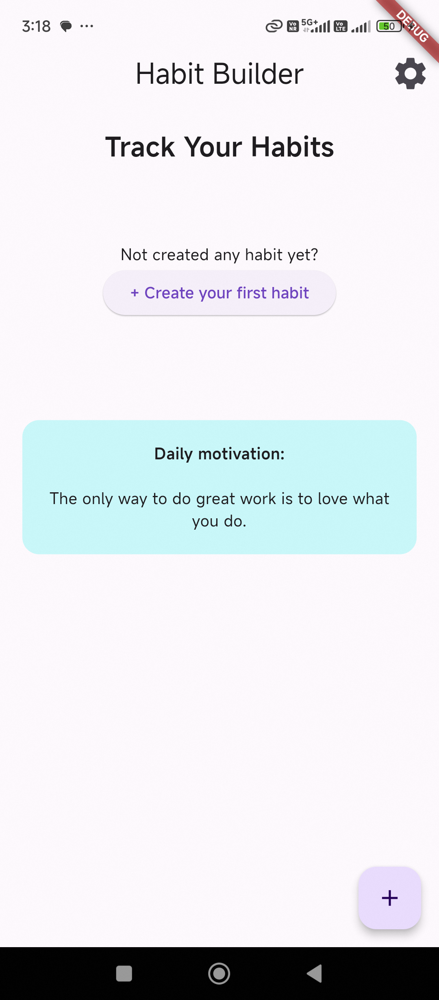
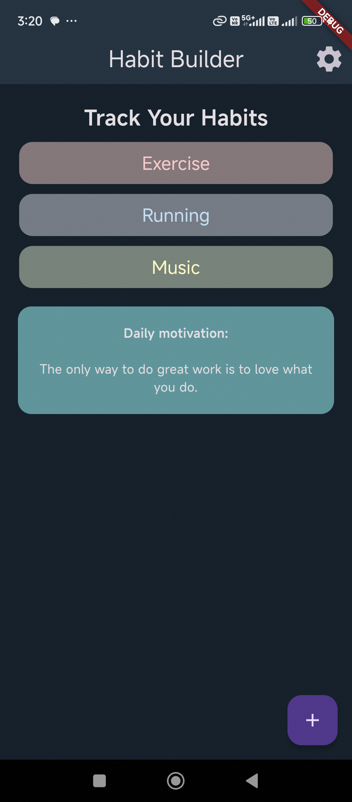

# Habit Builder

Habit Builder is a personal development app designed to help users build better habits. Small, consistent actions can lead to significant changes over time, and Habit Builder is here to support users every step of the way.

## Features

- **Track Habits**: Easily track your daily habits and monitor your progress over time.
- **Customizable Habits**: Create custom habits tailored to your specific goals and needs.
- **Reminder Notifications**: Set up reminder notifications to keep you on track with your habits.
- **Statistics and Insights**: Gain insights into your habits with detailed statistics and analytics.
- **Motivational Quotes**: Stay motivated with daily inspirational quotes to keep you focused on your goals.

## Screenshots

## Download on Google Play Store

